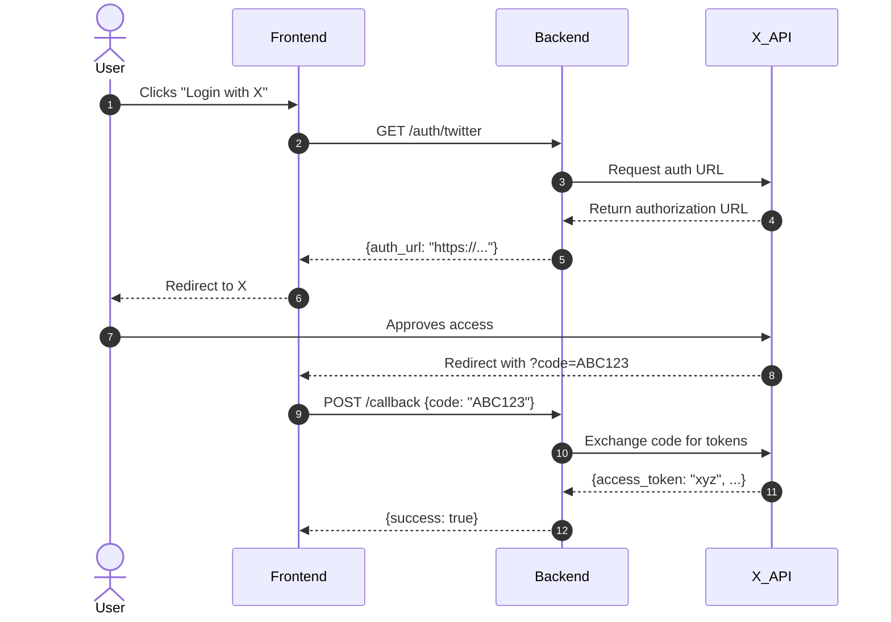

# Authentication Flow (MVP)

```mermaid
sequenceDiagram
    autonumber
    actor User
    participant Frontend
    participant Backend
    participant X_API

    User->>Frontend: Clicks "Login with X"
    Frontend->>Backend: GET /auth/twitter
    Backend->>X_API: Request auth URL
    X_API-->>Backend: Return authorization URL
    Backend-->>Frontend: {auth_url: "https://..."}
    Frontend-->>User: Redirect to X
    User->>X_API: Approves access
    X_API-->>Frontend: Redirect with ?code=ABC123
    Frontend->>Backend: POST /callback {code: "ABC123"}
    Backend->>X_API: Exchange code for tokens
    X_API-->>Backend: {access_token: "xyz", ...}
    Backend-->>Frontend: {success: true}
```
